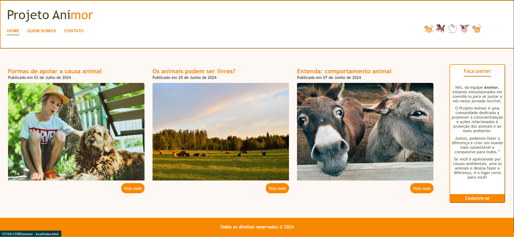
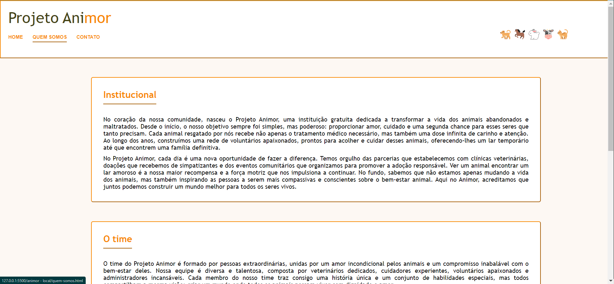
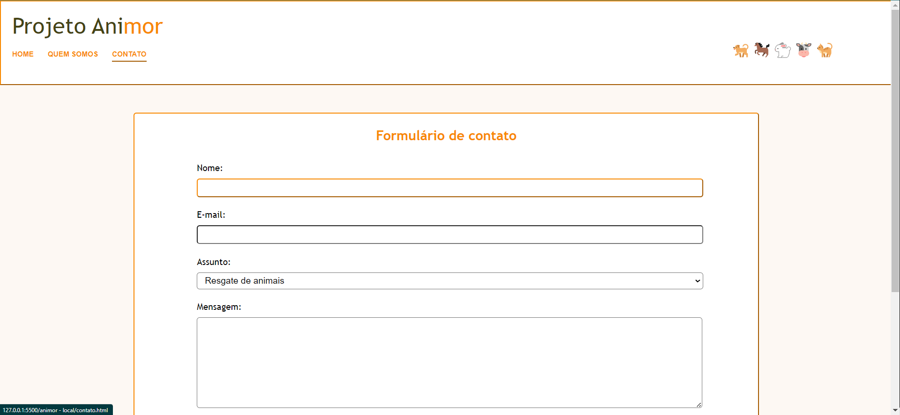
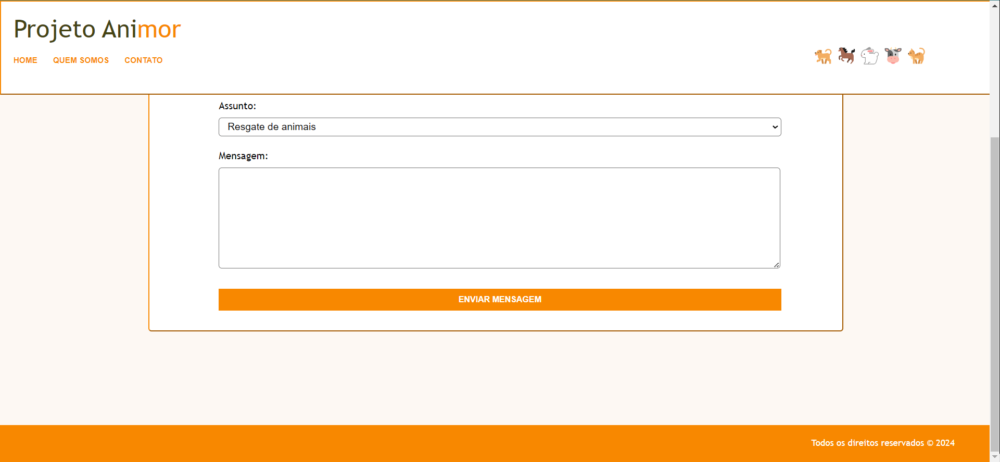

# Projeto Animor
Projeto Animor - Estudo de HTML5 e CSS3.

## Descrição
O projeto Animor é de minha autoria, o objetivo é colocar em prática os conteúdos até agora estudados por mim no Curso Desenvolvimento Web Completo ministrado pelo Prof° Jorge Sant'Ana e Prof° Jamilton Damasceno na plataforma Udemy.

## Tecnologias Utilizadas
- *HTML5*: Linguagem de marcação utilizada para o desenvolvimento da página;
- *CSS3*: Linguagem de estilo utilizada para estilizar os componentes do site.

## Home: 

## Quem somos: 

## Contato: 

## Contato II: 

## Autora
- *Bianca Reis Santana* - Desenvolvimento inicial - [ReisBianca]( https://github.com/ReisBianca)
